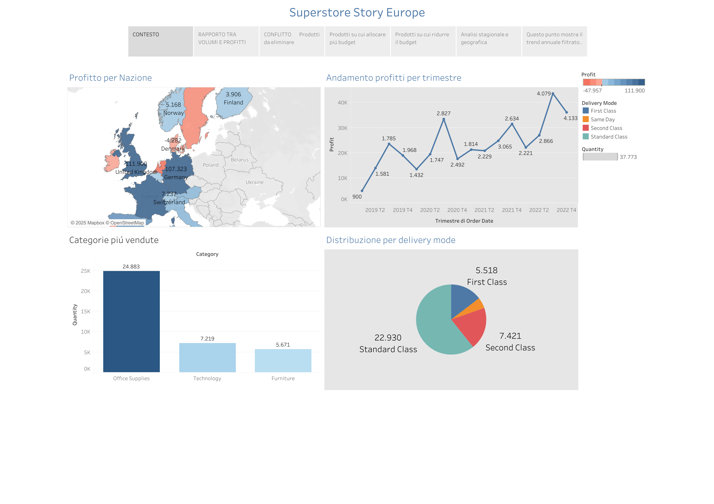

# 📊 Tableau Dashboard – Superstore Europe Story

Questo repository contiene una **dashboard interattiva** sviluppata in **Tableau** sul dataset *Superstore*, focalizzata sull’area **Europa**.  
L’obiettivo della dashboard è mostrare la relazione tra **volumi e profitti**, identificare conflitti nei prodotti e guidare decisioni strategiche di budget.

---

## 📂 Contenuto
- `STORY_EUROPE.pdf` → Esportazione statica della dashboard in formato PDF
- 

---

## 🚀 Funzionalità principali
La dashboard fornisce insight su:
- **Rapporto tra volumi e profitti**  
- Identificazione di **prodotti da eliminare** dal catalogo  
- Prodotti e categorie su cui **allocare più budget**  
- Prodotti e categorie su cui **ridurre il budget**  
- **Analisi stagionale** delle vendite per trimestre (2019–2022)  
- **Distribuzione geografica** dei profitti e delle vendite per nazione  
- **Distribuzione per modalità di consegna** e relativo impatto sui resi  

---

## 📸 Anteprima

---

## 🔧 Tecnologie
- [Tableau Desktop / Tableau Public](https://www.tableau.com/)  
- Dataset: **Sample Superstore** (fornito da Tableau)

---

## 📖 Utilizzo
1. Apri `STORY_EUROPE.pdf` per visualizzare la versione statica.  
2. Consulta la versione interattiva su **Tableau Public**: https://public.tableau.com/shared/KYRSD4CWB?:display_count=n&:origin=viz_share_link.
3. Scarica il file interattivo .twbx

---

## ✨ Autore
Progetto creato da **Gianmarco Martino**  
📧 Contatti: gianmymartino@gmail.com  
🌐 Portfolio: LinkedIn -- https://www.linkedin.com/in/gianmarco-martino-0323192a3/

----------------ENGLISH---------------------

# 📊 Tableau Dashboard – Superstore Europe Story

This repository contains an **interactive dashboard** developed in **Tableau** using the *Superstore* dataset, focused on the **European market**.  
The purpose of the dashboard is to highlight the relationship between **sales volumes and profits**, identify product conflicts, and support strategic budget allocation decisions.

---

## 📂 Content
- `STORY_EUROPE.pdf` → Static export of the dashboard in PDF format

---

## 🚀 Key Insights
The dashboard provides analysis on:
- **Relationship between volumes and profits**  
- Identification of **products to be removed** from the catalog  
- Products and categories where to **increase budget allocation**  
- Products and categories where to **reduce budget allocation**  
- **Seasonal analysis** of sales by quarter (2019–2022)  
- **Geographical distribution** of profits and sales by country  
- **Delivery mode distribution** and its impact on return costs  

---

---

## 🔧 Technologies
- [Tableau Desktop / Tableau Public](https://www.tableau.com/)  
- Dataset: **Sample Superstore** (provided by Tableau)

---

## 📖 How to Use
1. Open `STORY_EUROPE.pdf` to view the static version.
2. 2. Interactive versione on **Tableau Public**: https://public.tableau.com/shared/KYRSD4CWB?:display_count=n&:origin=viz_share_link.

---

## ✨ Author
Created by **Gianmarco Martino**  
📧 Contact: gianmymartino@gmail.com  
🌐 Portfolio: LinkedIn -- https://www.linkedin.com/in/gianmarco-martino-0323192a3/

